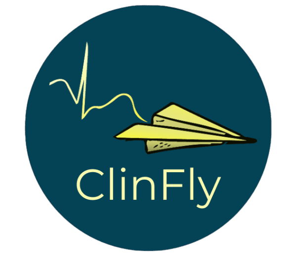
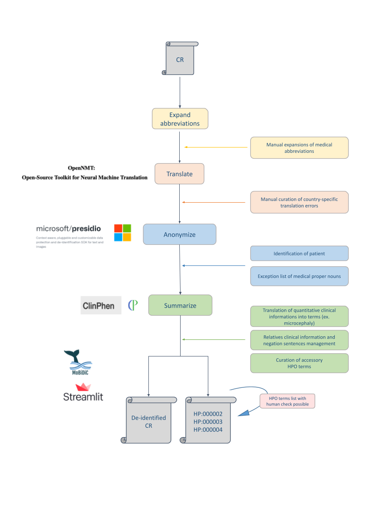

# ClinFly



Contact : [kevin.yauy@chu-montpellier.fr](mailto:kevin.yauy@chu-montpellier.fr)

## Introduction

ClinFly is an automated framework designed to facilitate precision medicine (PM) for rare diseases. It addresses the challenge of precision phenotyping and data sharing across different languages.

ClinFly can anonymize, translate, and summarize clinical reports using Human Phenotype Ontology (HPO) terms, ensuring compliance with medical data privacy standards. The output includes a de-identified translated clinical report and a summary report in HPO format.

By streamlining the translation and anonymization of clinical reports, ClinFly aims to enhance inter-hospital data sharing, expedite medical discoveries, and pave the way for an international patient file accessible to non-English speakers.

## Pipeline



## Installation

### Docker

`Dockerfile` is provided to build the ClinFly image.

```bash
docker build -t clinfly:latest .
```

### Local installation

You'll need [`poppler`](https://pdf2image.readthedocs.io/en/latest/installation.html) and [`tesseract-ocr`](https://tesseract-ocr.github.io/tessdoc/Installation.html) installed in your os to use OCR on pdf file.
In addition, NLP models is needed to be downloaded.

```bash
# Install on Ubuntu
apt-get install -y poppler-utils tesseract-ocr

```

To install ClinFly on your local machine you need the `poetry` package manager. Navigate to the project folder and run:

```bash
poetry env use 3.11.5 # Adapt to an installed python version ">=3.8.0,<3.12, !=3.9.7"
poetry install

# Download necessary models for stanza, nltk, and spacy
poetry run python -c "import stanza; stanza.download('fr', dir='~/stanza_resources'); stanza.download('de', dir='~/stanza_resources'); stanza.download('es', dir='~/stanza_resources'); stanza.download('en', dir='~/stanza_resources')"
poetry run python -c "import nltk; nltk.download('omw-1.4', download_dir='~/nltk_data'); nltk.download('wordnet', download_dir='~/nltk_data')"
poetry run python -c "import spacy; spacy.cli.download('en_core_web_lg')"
```

If you need to generate a `requirements.txt` file, use the following command:

```bash
poetry export --without-hashes --format=requirements.txt > requirements.txt
```

## Usage

### Graphical User Interface

For single report usage with interactive analysis, ClinFly provides a web application accessible at <https://clinfly.project.erios.ai>

Using docker:

```bash
docker run --rm -p 8501:8501 --name clinfly-app clinfly:latest
```

Or to run the Streamlit application on your local computer using poetry, activate the poetry env and run the `clinfly_app_st.py` file:

```bash
poetry run streamlit run clinfly_app_st.py
```

### Command Line Interface

For processing multiple reports with offline options, use the command line interface provided by `clinfly_app_cli.py`.

The input should be a TSV .tsv file structured as follows (see `data/test.tsv` for an example):

```markdown
Report_id_1   Doe  John  Report text 
...
Report_id_X   Doe  John  Report text
```

You can also put a symlink to a pdf file (see `data/test_pdf.tsv` for an example)

```markdown
Report_id_X   Doe  John  Example.pdf
```

Outputs will be placed in the `results` folder according to the file extension, using first three columns in filename.

- The deidentify report will be generated and placed in the `results/Reports` folder.
- Three HPO extraction outputs will be generated in `TSV`, `TXT` and `JSON` folders.

Using docker and the toy example:

```bash
docker run --rm \
  clinfly:latest \
  python clinfly_app_cli.py --file data/test.tsv --language fr
```

Or to run the CLI application on your local computer:

```bash
poetry run python clinfly_app_cli.py --file <input txt file with the reports> --language <language of the file> --model_dir <The output directory of the model (OPTIONAL)> --result_dir <The output directory of the generated result (OPTIONAL)>
```

Using the toy example:

```bash
poetry run python clinfly_app_cli.py --file data/test.tsv --language fr 
```

## Acknoledgments and reference

ClinFly is a tool developed by University Hospital of Montpellier and Hospices Civils de Lyon. Thanks to the developers, especially Enody Gernet and Xavier Corbier for his contribution.

If you use ClinFly, please cite:
> Gauthier et al., Assessing feasibility and risk to translate, de-identify and summarize medical letters using deep learning. medrXiv (2023). [https://doi.org/10.1101/2023.07.27.23293234](https://doi.org/10.1101/2023.07.27.23293234)
